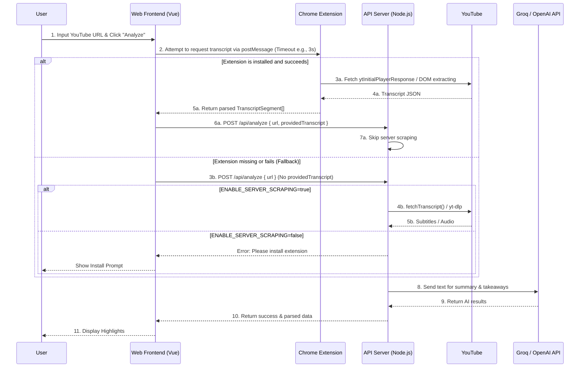

# Technical Specification: Extension Hybrid Architecture / 技术规格书：浏览器插件混合架构

## 1. Background & Goals / 背景与目标

### 1.1 Background / 背景
The project relies heavily on fetching transcripts and audio from YouTube. However, server-side data extraction (via data center APIs like Railway) is frequently blocked by YouTube's strict anti-scraping mechanisms (e.g., IP reputation, 429 Too Many Requests, reCAPTCHA). Relying solely on server-side rendering or `yt-dlp` is unsustainable for production.

本项目严重依赖从 YouTube 获取字幕和音频。然而，基于服务端的提取（通过 Railway 等数据中心 IP）经常被 YouTube 严格的反爬机制（如 IP 信誉、429 请求过多、人机验证）拦截。在生产环境中，仅依靠服务端或 `yt-dlp` 获取数据是不可持续的。

### 1.2 Goals / 目标
*   **Decentralized Data Extraction / 去中心化数据获取:** Offload data extraction to the highest-trusted environment: the user's local browser via a Chrome Extension. / 将数据获取下放到最信任的环境中：即通过 Chrome 插件在用户的本地浏览器上执行。
*   **Privacy & Compliance / 隐私与合规:** Do NOT transmit user cookies. Extract only public text/data directly via the DOM and pass it to the backend. / 绝对不传输用户 Cookie。仅通过 DOM 直接提取公开文本/数据并传给后端。
*   **Progressive Enhancement & Fallback / 渐进式增强与兜底:** The Web app retains its existing interactions. If the extension is present, it uses client-side data. If absent, it gracefully falls back to the server-side extraction logic. / Web 应用保留现有交互。若检测到插件，则优先使用客户端数据；否则平滑降级到服务端抓取逻辑。
*   **Local Backend Isolation / 本地开发隔离:** Preserve the server-side extraction capabilities for local development and testing, controlled via environment variables. / 保留服务端的抓取能力以便于本地开发和测试，并通过环境变量进行隔离控制。

---

## 2. Architecture Design / 架构设计

### 2.1 System Components / 系统组件

1.  **AI Video Highlights Web (Vue 3)**: The main user interface. Responsible for detecting the extension, coordinating the analysis task, and displaying results. / 核心用户界面。负责探测插件状态、调度分析任务和展示结果。
2.  **Chrome Extension (Manifest V3)**: Runs seamlessly in the background. Listens for messages from the Web app, fetches YouTube transcripts using the user's authentic session, and returns the raw text. / 在后台静默运行。监听 Web 应用的消息，利用用户真实的浏览器会话获取 YouTube 字幕，并返回纯文本。
3.  **Backend Server (Fastify + Node.js)**: Receives the data (either directly from the Extension/Web or falls back to its own scrapers), performs AI processing via Groq/OpenAI, and stores results. / 接收数据（无论是来自插件还是服务端自身的兜底爬虫），通过 Groq/OpenAI 进行 AI 处理并存储结果。

### 2.2 The Hybrid Execution Flow / 混合执行流



---

## 3. Environment Isolation / 环境隔离机制

To protect the production server's IP from being banned, server-side scraping must be strictly controlled.

为保护生产服务器的 IP 免遭封禁，必须严格控制服务端的爬虫行为。

### 3.1 Environment Variable / 环境变量
Introduce `ENABLE_SERVER_SCRAPING` in `.env`:
引入环境变量 `ENABLE_SERVER_SCRAPING`：

*   **Local Development (`.env.local`)**: `ENABLE_SERVER_SCRAPING=true`
    *   Allows developers to test endpoints directly without forcing the extension installation.
    *   允许开发者直接测试接口，无需强制安装插件。
*   **Production (`.env.production`)**: `ENABLE_SERVER_SCRAPING=false`
    *   Denies server-side scraping. If `providedTranscript` is missing, the API rejects the request, forcing the user to use the extension.
    *   禁止服务端爬虫。如果请求缺少 `providedTranscript`，API 直接拒绝，强制用户通过插件获取。

### 3.2 Backend Logic / 后端逻辑防御

```typescript
// Pseudo-code in /api/analyze
if (!providedTranscript) {
    if (process.env.ENABLE_SERVER_SCRAPING !== 'true') {
        throw new Error('Production Policy: Client-side extension required to bypass anti-scraping.');
    }
    // Proceed with fallbackToWhisper or youtube-transcript-plus
}
```

---

## 4. Implementation Phasing / 实施阶段规划

### Phase 1: Backend API Adaptation / 第一阶段：后端 API 适配
*   **Task**: Modify `POST /api/analyze` to accept the optional `providedTranscript` field.
*   **Task**: Implement the `ENABLE_SERVER_SCRAPING` gate to isolate local vs. production scraping.
*   **Status**: Pending

### Phase 2: Chrome Extension MVP / 第二阶段：插件 MVP 开发
*   **Task**: Create `extension` directory with `manifest.json` (V3).
*   **Task**: Develop `content-script.js` to bridge Web app and Extension.
*   **Task**: Develop `background.js` to silently hook into YouTube or parse provided video URLs for subtitles.
*   **Status**: Pending

### Phase 3: Web App Integration / 第三阶段：Web 端集成
*   **Task**: Update `VideoAnalysisModal.vue` target logic to emit a probe message before submitting the task.
*   **Task**: Wait for extension response. If successful, inject data into payload. If timeout/fail, proceed as usual (fallback).
*   **Status**: Pending
