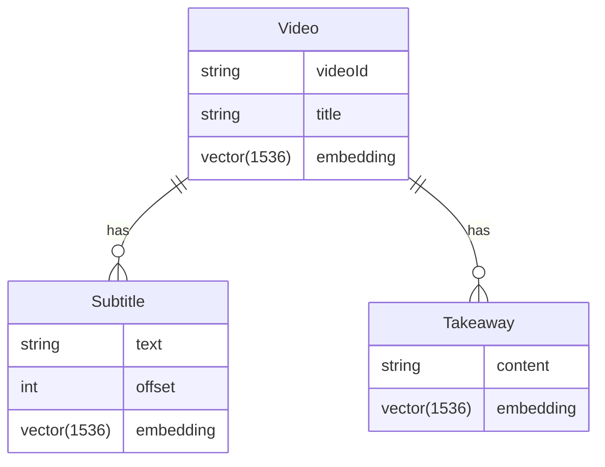

# 🎬 视频语义搜索技术方案 (Semantic Search Implementation Plan)

## 0. 核心目标 (Core Objectives)
实现基于自然语言的视频内容检索。用户可以通过描述“视频里提到了关于深度学习的什么配置？”来找到对应的视频及其精确的时间片段，而不仅仅是匹配标题关键字。

---

## 1. 技术架构 (Architectural Strategies)

为了平衡 **成本 (Cost)**、**隐私 (Privacy)** 和 **性能 (Performance)**，系统支持两种 Embedding 方案，可通过环境变量 `EMBEDDING_STRATEGY` 切换：

### 方案 A：本地化语义 (Local Precision) - [默认/推荐]
- **实现**: 使用 `@xenova/transformers` (Transformers.js) 在本地运行嵌入模型。
- **推荐模型**: `Xenova/bge-m3` (语义更强、支持多语言的 1024 维模型)。
- **维度**: 1024 维 (极速且精准)。
- **优势**: **100% 免费**，数据不离机，无需 API Key。

### 方案 B：云端加速 (Cloud Scalability)
- **平台**: OpenAI / SiliconFlow / 阿里云百炼。
- **配置**: 通过项目 `.env` 中的 `EMBEDDING_API_KEY` 和 `EMBEDDING_MODEL` 控制。
- **维度**: 根据模型定 (如 OpenAI 的 1536 维，或 BGE-M3 的 1024 维)。
- **优势**: 响应更稳定，适合大规模并发，无需本地算力。

---

## 2. 核心配置 (Configuration)

在 `server/.env` 中新增以下配置：
```env
# 选项: 'local' | 'cloud'
EMBEDDING_STRATEGY=local

# 如果使用云端方案 (如 SiliconFlow)
EMBEDDING_API_BASE=https://api.siliconflow.cn/v1
EMBEDDING_API_KEY=sk-xxxxxx
EMBEDDING_MODEL=BAAI/bge-m3
```

## 2. 数据库变更 (Schema Changes)

我们需要为现有的数据模型增加向量存储列 (Vector columns)。



### Prisma Schema 更新建议：
```prisma
// 在 schema.prisma 中开启预览
generator client {
  provider        = "prisma-client-js"
  previewFeatures = ["postgresqlVector"]
}

model Video {
  // ... 其他字段
  embedding   Unsupported("vector(1536)")? // 视频标题/整体描述的向量
}

model Subtitle {
  // ... 其他字段
  embedding   Unsupported("vector(1536)")? // 每一句字幕的向量
}
```

---

## 3. 核心实施步骤 (Implementation Steps)

### 第一阶段：基础设施与 Service 层
1. **数据库准备**: 在 PostgreSQL 中执行 `CREATE EXTENSION vector;`。
2. **AI 工具层**: 在 `server/src/services/ai.ts` 中封装 `getEmbedding(text: string)` 方法。
3. **Prisma 配置**: 更新 Prisma Client 并执行迁移，添加 `embedding` 列。

### 第二阶段：数据摄入流 (Data Ingestion Pipeline)
1. **修改分析流程**: 在 `analyzeTranscript` 成功后，异步调用 Embedding 服务。
2. **分段处理**: 为提高搜索精度，不只是对整个视频做向量化，还需对 `Subtitle` 表中的每一条（或以 30s 为周期合并的块）进行向量化。
3. **存库**: 将生成的 1536 维向量存入对应表的 `embedding` 列。

### 第三阶段：搜索接口实现 (Search API)
1. **API 设计**: `GET /api/search?q=...`。
2. **检索逻辑**:
   - 将用户查询词 `q` 实时转化为向量。
   - 使用 Prisma 的 `$queryRaw` 执行向量距离计算。
   - 结果排序：根据相似度分数合并“视频匹配”和“片段匹配”。

### 第四阶段：前端交互设计 (UI/UX)
1. **全局搜索框**: 在首页或导航栏显著位置。
2. **结果展示**:
   - 展示视频封面与标题。
   - 高亮展示匹配到的“金句”及其对应的时间点。
   - 点击结果直接跳转到 `VideoView` 并自动 `seekTo` 对应时间。

---

## 4. 关键挑战与优化建议
- **成本控制**: Embedding 费用极低（1k tokens 约 $0.00002），但大量存库仍需考虑频率。建议仅对中文翻译后的字幕进行向量化。
- **分段策略 (Chunking)**: 并非单句字幕搜索效果最好，建议采用“滑动窗口”将 2-3 句字幕合并为一个语义块进行向量化，提升检索召回率。
- **性能**: 对于数万级以上的片段，建议在向量列上建立 `HNSW` 索引。
