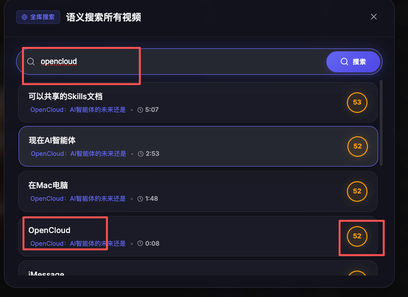

# 语义搜索优化记录 / Semantic Search Optimization Log

## 1. 用户反馈与问题提问 / User Feedback & Question

### 中文
**提问**：为什么搜索某些非常匹配的词（如 "OpenCloud"）时，明明视频里有对应的字幕，但搜索结果的评分却很低，甚至排序也不在第一位？

### English
**Question**: Why do certain highly relevant terms (e.g., "OpenCloud") have low similarity scores and appear lower in the search results, even when exact matches exist in the subtitles?

---

## 2. 问题解释 / Explanation

### 中文
**核心原因**：当前的搜索完全基于**向量相似度（Vector Similarity）**。
- **语义 vs 字面**：AI 向量模型（如 BGE 或 OpenAI Embedding）擅长理解“语义”（例如搜索“水果”能搜到“苹果”），但在处理**专有名词、品牌名或缩写**时，这些词在向量空间中的分布可能并不极端，导致它们与查询词的余弦距离并不比一些“语义相关但字面不匹配”的句子更优。
- **分值稀释**：短单词（如 "OpenCloud"）在长句子向量中占权重较小，导致纯向量计算出的原始分值往往在 0.5 - 0.6 之间，视觉上显示为琥珀橙（普通匹配），不符合用户对“精确匹配”的直觉。

### English
**Root Cause**: The search was previously purely based on **Vector Similarity**.
- **Semantic vs. Literal**: AI embedding models (like BGE or OpenAI) excel at understanding "meaning" (e.g., searching for "fruit" finds "apple"). However, for **proper nouns, brand names, or abbreviations**, their distribution in vector space might not be extreme enough to outperform sentences that are "semantically related but not literal matches."
- **Score Dilution**: Short terms (like "OpenCloud") have relatively low weights in a sentence's overall vector, resulting in raw scores around 0.5 - 0.6, which are displayed as Amber (Normal match), misaligning with the user's expectation of an "exact match."

---

## 3. 处理方法 / Processing Method

### 中文
**处理手段**：引入**混合检索（Hybrid Search）**，在数据库层面增加**关键词增强（Keyword Boosting）**逻辑。

**具体实现**：
1. **关键词奖励**：在执行 SQL 向量检索的同时，检查字幕文本（`text` 或 `translated_text`）是否直接包含搜索关键词。
2. **权重注入**：
    - 如果文本完全匹配搜索词，额外加 **0.3** 分。
    - 如果文本模糊包含搜索词，额外加 **0.15** 分。
3. **算法逻辑**：`最终评分 = LEAST(1.0, 向量分 + 匹配奖励)`。

### English
**Solution**: Implementation of **Hybrid Search** by adding **Keyword Boosting** logic at the database level.

**Implementation**:
1. **Keyword Reward**: While performing the vector search in SQL, checked if the subtitle text (`text` or `translated_text`) directly contains the search query.
2. **Weight Injection**:
   - If the text matches the query exactly, a bonus of **+0.3** is added.
   - If the text partially contains the query, a bonus of **+0.15** is added.
3. **Algorithmic Logic**: `Final Score = LEAST(1.0, Vector_Score + Match_Bonus)`.

---

## 4. 优化后的效果 / Optimized Result

### 中文
- **精准直达**：包含 "OpenCloud" 的结果分值会瞬间提升至 0.85+（显示为翡翠绿），并由于分值最高而排在首位。
- **两全其美**：既保留了 AI 对自然语言描述的“语义理解”能力（即使没搜到原词也能搜到意思），又解决了特定词汇“搜不准”的硬伤。

### English
- **Direct Precision**: Results containing "OpenCloud" now see scores jump to 0.85+ (displayed in Emerald Green) and rank first due to the highest score.
- **Best of Both Worlds**: It retains the AI's "semantic understanding" (finding meaning even without the exact word) while fixing the glaring issue of "finding specific terms."
